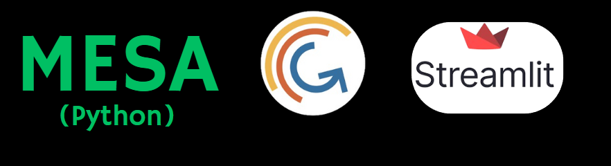
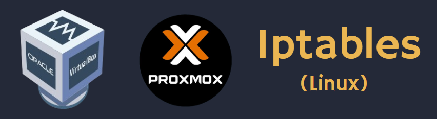
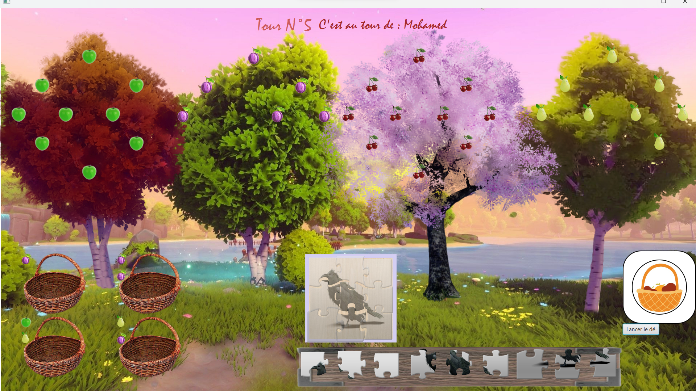
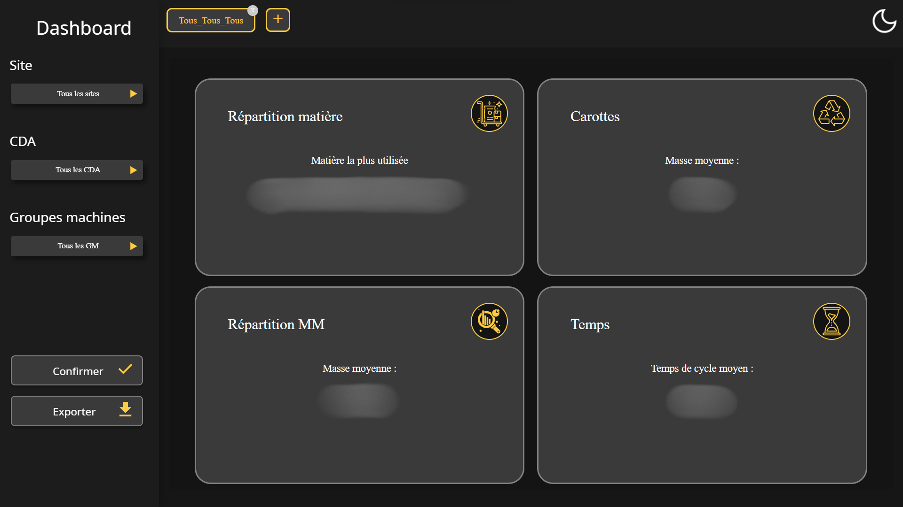

  

# ***Bonjour ! Je suis Mohamed MESRI***

Je suis actuellement étudiant en **3ème année de BUT Informatique**. Depuis mes débuts dans le domaine, ma passion pour l'informatique n'a cessé de croître. Je suis particulièrement fasciné par les avancées technologiques, et c'est dans le secteur de la **cybersécurité** que je souhaite approfondir mes connaissances et construire ma carrière. Mon objectif est de devenir un **expert** dans ce domaine dynamique et en constante évolution.

# 💻 ***Languages et outils utilisés***

<table>
  <tr>
    <td>
      <h4><i>Dévelopement WEB</i></h4>
      

        
      

      <h4><i>Dévelopement Mobile</i></h4>
      

        
      

      <h4><i>Dévelopement d'Application</i></h4>
      

        
      

      <h4><i>BDD</i></h4>
      

        
      

      <h4><i>Système Multi-Agent</i></h4>
      

        
      

      <h4><i>Réseau / Virtualisation</i></h4>
      

         
        
      

    </td>
    <td>
      <h4><i>IDE</i></h4>
      

        
      

      <h4><i>Gestionnaire de version</i></h4>
      

        
      

    </td>
  </tr>
</table>

# 🚀 ***Mes projets***

## ***Jeu du Verger***

 
Le jeu du Verger est une adaptation numérique du célèbre jeu de société coopératif pour enfants, développée en Java avec JavaFX. Cette version interactive conserve l'essence du jeu original tout en offrant une expérience ludique sur plateforme digitale. 

#### *Caractéristiques principales*  
*Joueur* : 1 à 3 joueurs  
*Objectif* : Récolter tous les fruits avant que le corbeau ne complète son puzzle  
*Langages* : Java, JavaFX  
*Type* : Jeu de société coopératif  

#### *Gameplay*
 

Les joueurs collaborent pour récolter les fruits de quatre arbres différents (pommier, cerisier, prunier, poirier) et remplir leurs paniers avant que le corbeau n'achève son puzzle. À chaque tour, les joueurs lancent un dé qui détermine leur action : 
 

*Couleur* : Récolter un fruit de l'arbre correspondant  
*Panier* : Choisir et récolter deux fruits de n'importe quel arbre  
*Corbeau* : Ajouter une pièce au puzzle du corbeau  

#### *Défis techniques*

Implémentation d'une interface utilisateur intuitive avec JavaFX
Gestion des règles du jeu et de la logique de tour par tour
Création d'un système de jeu coopératif fluide

#### *Compétences démontrées*

Programmation orientée objet en Java
Développement d'interfaces graphiques avec JavaFX
Conception et implémentation de logique de jeu
Adaptation d'un concept de jeu physique à un environnement numérique

Ce projet démontre ma capacité à transformer un jeu de société classique en une expérience numérique engageante, tout en respectant les mécaniques de jeu originales et en créant une interface utilisateur attrayante.

  
- Application d'analyse/conception de transformation de matière plastique

  

  

<!---
Mohamed-hub16/Mohamed-hub16 is a ✨ special ✨ repository because its `README.md` (this file) appears on your GitHub profile.
You can click the Preview link to take a look at your changes.
--->
<!--Footer--> 

