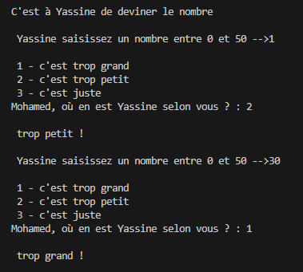
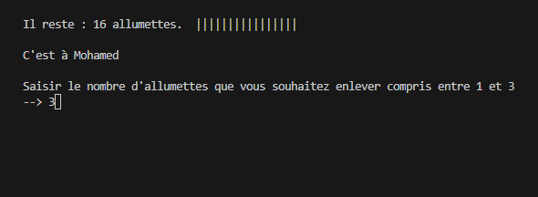
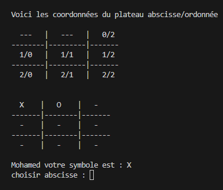
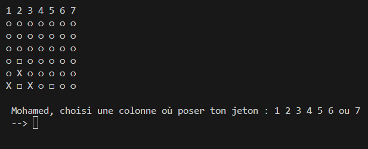

## :superhero_man: Qui suis-je

Je m'appelle Mohamed MESRI et je suis actuellement étudiant en 2ème année de BUT informatique. Depuis mes débuts dans ce domaine, ma passion pour l'informatique n'a cessé de croître. J'ai toujours été fasciné par les avancées technologiques et je suis particulièrement attiré par les domaines de l'intelligence artificielle (IA) et de la cybersécurité. Mon objectif professionnel est de poursuivre une carrière dans l'un de ces domaines, où je pourrai contribuer activement à l'innovation et à la sécurité de la technologie de demain.

## 💻 Langages de programmation utilisés

## 🌟 Mes qualités

- Autonome et capable de travailler efficacement en équipe
- Capacité d'analyse et de résolution de problèmes
- Orienté vers les résultats avec une attention aux détails
- Déterminé et rigoureux
## 🚀 Mes projets

- Jeu du Verger

  
  
J'ai développé le jeux de sociéte : le Verger avec les langages de programmation Java/JavaFX. C'est un jeux collectif qui se joue à 3 joueurs maximum, qui a pour but de cuillir les fruits du pommier, cerisier, prunier et poirier de remplir 4 pannier avec avant que le puzzle du corbeaux ne soit complété. Pour se faire les joueurs doivent lancé le dé chacun leur tour 3 cas possible -> couleur : prendre le fruit de la couleur. panier : prendre deux fruit aux choix. corbeau : mettre une pièce du puzzle.

- Jeu Python : (Jeux des devinnettes / allumettes / morpion / puissance 4)

  

     
     
    
    
  

   
  

Cette application regroupe 4 jeux fondamentaux dans le monde à savoir, le jeu des 
devinettes, de l’allumette, du morpion et du puissance 4 offrant la possibilité de jouer joueur vs joueur, joueur vs BOT, BOT vs BOT. De plus, cette application gère 
les scores des joueurs qui ont remporté au moins une partie dans un jeu avec un 
classement par jeux ou par score total. Un joueur peut se reconnecter avec le même 
pseudo pour récupérer ses scores. On peut donc considérer notre application comme un 
  
- [Projet 3](lien_vers_projet_3) : Description succincte du projet 3.

## 🌐 Centres d'intérêt

En dehors de la programmation, mes centres d'intérêt incluent :

- La lecture
- La randonnée
- La musique
- Les jeux de société

N'hésitez pas à me contacter si vous avez des questions ou si vous souhaitez collaborer sur un projet !

<!---
Mohamed-hub16/Mohamed-hub16 is a ✨ special ✨ repository because its `README.md` (this file) appears on your GitHub profile.
You can click the Preview link to take a look at your changes.
--->
