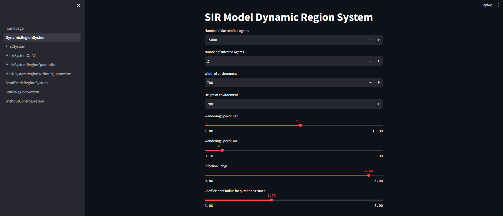
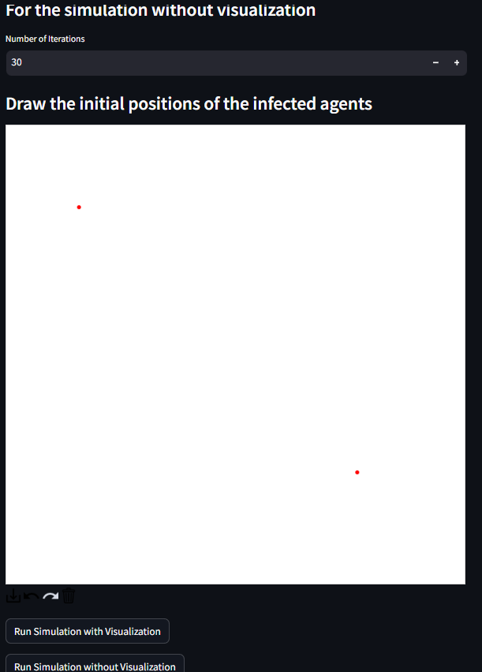
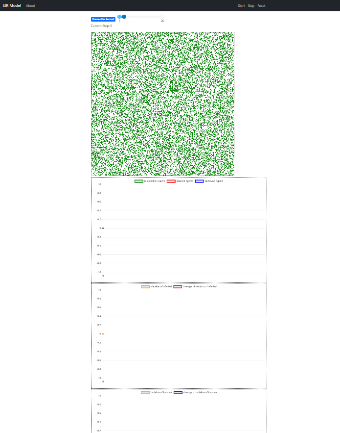
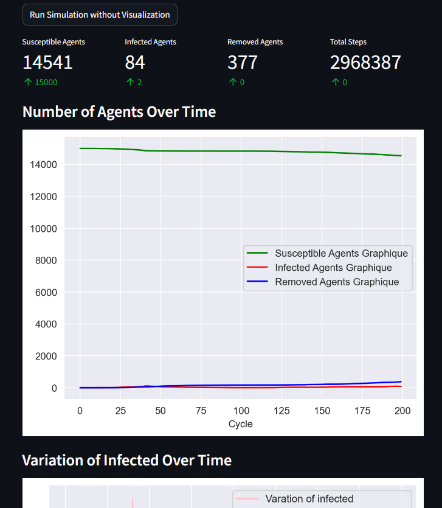

  

# ***Bonjour ! Je suis Mohamed MESRI***

Je suis actuellement étudiant en **3ème année de BUT Informatique**. Depuis mes débuts dans le domaine, ma passion pour l'informatique n'a cessé de croître. Je suis particulièrement fasciné par les avancées technologiques, et c'est dans le secteur de la **cybersécurité** que je souhaite approfondir mes connaissances et construire ma carrière. Mon objectif est de devenir un **expert** dans ce domaine dynamique et en constante évolution.

# 💻 ***Languages et outils utilisés***

<table>
  <tr>
    <td>
      <h4><i>Dévelopement WEB</i></h4>
      

        
      

      <h4><i>Dévelopement Mobile</i></h4>
      

        
      

      <h4><i>Dévelopement d'Application</i></h4>
      

        
      

      <h4><i>BDD</i></h4>
      

        
      

      <h4><i>Système Multi-Agent</i></h4>
      

        
      

      <h4><i>Réseau / Virtualisation</i></h4>
      

         
        
      

    </td>
    <td>
      <h4><i>IDE</i></h4>
      

        
      

      <h4><i>Gestionnaire de version</i></h4>
      

        
      

      <h4><i>Gestion de Projet</i></h4>
      

        
        
      

    </td>
  </tr>
</table>

# 🚀 ***Mes projets préférés***

## ***Jeu du Verger***

 
Le jeu du Verger est une adaptation numérique du célèbre jeu de société coopératif pour enfants, développée en Java avec JavaFX. Cette version interactive conserve l'essence du jeu original tout en offrant une expérience ludique sur plateforme digitale. 

#### *Caractéristiques principales*  
*Joueur* : 1 à 3 joueurs  
*Objectif* : Récolter tous les fruits avant que le corbeau ne complète son puzzle  
*Langages* : Java, JavaFX  
*Type* : Jeu de société coopératif  

#### *Gameplay*
 

Les joueurs collaborent pour récolter les fruits de quatre arbres différents (pommier, cerisier, prunier, poirier) et remplir leurs paniers avant que le corbeau n'achève son puzzle. À chaque tour, les joueurs lancent un dé qui détermine leur action : 

 *Couleur* : Récolter un fruit de l'arbre correspondant  
*Panier* : Choisir et récolter deux fruits de n'importe quel arbre  
*Corbeau* : Ajouter une pièce au puzzle du corbeau  

#### *Défis techniques*

Implémentation d'une interface utilisateur intuitive avec JavaFX
Gestion des règles du jeu et de la logique de tour par tour
Création d'un système de jeu coopératif fluide

#### *Compétences démontrées*

Programmation orientée objet en Java
Développement d'interfaces graphiques avec JavaFX
Conception et implémentation de logique de jeu
Adaptation d'un concept de jeu physique à un environnement numérique

Ce projet démontre ma capacité à transformer un jeu de société classique en une expérience numérique engageante, tout en respectant les mécaniques de jeu originales et en créant une interface utilisateur attrayante.

## ***Application d'analyse/conception de transformation de matière plastique : LeGrand***

Ce projet a été réalisé dans le cadre d'une SAE (Situation d'Apprentissage et d'Évaluation) pour l'entreprise Legrand, leader mondial des infrastructures électriques et numériques du bâtiment. L'objectif était de développer une application web permettant de visualiser et d'analyser les données de production, notamment celles liées au processus de moulage par injection plastique.

#### *Confidentialité des Données*

  
*Note : L'image ci-dessus présente l'interface de l'application avec certaines valeurs floutées pour des raisons de confidentialité.*  

Ce projet a été réalisé en collaboration avec Legrand, une entreprise leader dans son domaine. En tant qu'équipe de développement, nous étions soumis à une charte informatique stricte qui garantissait la protection des données sensibles de l'entreprise.

 *Conformément à nos engagements :*
- Les valeurs spécifiques affichées dans l'application ont été floutées dans les captures d'écran partagées publiquement.  
- À la fin du projet, nous avons supprimé toutes les copies de la base de données fournies par Legrand.  
- Aucune donnée réelle ou sensible n'est stockée ou partagée dans ce dépôt GitHub.  

Cette approche reflète notre engagement envers la sécurité des données et le respect des accords de confidentialité, tout en permettant de présenter le design et les fonctionnalités de l'application développée.

#### *Fonctionnalités Principales*  
- Visualisation des données de production en temps réel  
- Analyse des taux de recyclage des matières plastiques  
- Vérification des gammes de moulages  
- Génération de statistiques d'utilisation des matières  
- Filtrage des données par site, CDA (Centre d'Analyse) et groupe de machines  
- Export des données au format CSV  

#### *Technologies Utilisées*  
- Frontend : React.js  
- Backend : Node.js  
- Base de données : SQL Server (gérée via Azure Data Studio)  
- Styles : SASS  
- Gestion de versions : Git  
- Tests : Jest (97% de couverture)  

#### *Méthodologie*
- Conception UX/UI avec Figma
- Gestion de projet agile avec Trello
- Développement itératif avec feedback régulier du client

#### *Compétences Développées*
- Travail en équipe sur un projet d'envergure
- Apprentissage autonome de nouvelles technologies (React, SASS)
- Conception d'interfaces utilisateur ergonomiques
- Gestion de projet et organisation du travail
- Connexion et manipulation de bases de données
- Mise en place de tests unitaires

#### *Challenges Relevés*
- Adaptation aux exigences d'une grande entreprise
- Gestion de données complexes et volumineuses
- Conception d'une interface utilisateur intuitive pour des données techniques
- Collaboration efficace au sein d'une équipe de 5 développeurs

#### *Perspectives*
Ce projet a le potentiel d'être adapté et intégré dans les processus de production de Legrand, offrant ainsi une solution concrète pour l'optimisation de la gestion des ressources et l'amélioration de l'efficacité de la production.

## ***SIMULATION MULTI-AGENTS DE STRATÉGIES DE GESTION DE LA PROPAGATION DES ÉPIDÉMIES***

Ce projet a été réalisé dans le cadre d'un stage de recherche à l'Université de Craiova en collaboration avec le professeur Costin Bădică, expert en intelligence artificielle et systèmes multi-agents. L'objectif était de concevoir et de simuler diverses stratégies de gestion des épidémies à travers un modèle multi-agents (ABMS), en étudiant notamment l'impact de différentes mesures de contrôle (confinement, port du masque, etc.) sur la propagation d'une maladie infectieuse.  

#### *Contexte et Objectifs*  

Le projet s'inscrit dans un contexte de recherche scientifique sur la modélisation des épidémies, notamment face à des crises sanitaires récentes telles que le COVID-19. Le principal objectif était d’évaluer l’efficacité des stratégies de gestion pour limiter la propagation d’une épidémie tout en préservant autant que possible les libertés individuelles.  

*Note : Les images ci-dessus présente l'interface de l'application web*  
#### *Fonctionnalités Clés*  

-*Modélisation multi-agents basée sur le modèle SIR* (Susceptible, Infecté, Retiré) pour simuler la propagation des infections dans un environnement continu.  

-*Stratégies de gestion de crise* :
<ul>
  <li>Quarantaine et confinement à travers la limitation des déplacements.  </li>
  <li>Création de zones statiques et dynamiques pour cibler les foyers d'infection.  </li>
  <li>Port du masque avec différentes configurations (port généralisé ou ciblé dans des zones).  </li>
</ul>

-*Analyse des résultats* avec des graphiques dynamiques montrant l'évolution de l'épidémie et l'impact des stratégies.  
-*Application web interactive* permettant la personnalisation des paramètres de simulation et l’observation en temps réel.  

#### *Technologies Utilisées*  

-*MESA* (Framework en Python pour la modélisation multi-agents)  
-*Streamlit* (pour l'interface web interactive)  
-*Scikit-learn* (utilisé pour l'algorithme de clustering K-Means dans la gestion des zones dynamiques)  
-*JavaScript* (pour la visualisation des agents en temps réel)  
-*Git* (pour la gestion de versions)  

#### *Méthodologie*  

-Approche itérative avec des ajustements réguliers suite aux résultats des simulations.  
-Développement de la visualisation des agents en Python et JavaScript.  
-Utilisation d'un algorithme de clustering pour les zones dynamiques, afin de cibler de manière précise les foyers d'infection et optimiser les mesures de contrôle.  

#### *Compétences Développées*  

-*Modélisation et simulation multi-agents* : Compréhension et mise en place du modèle SIR en utilisant le framework MESA.  
-*Développement d'interfaces web interactives* : Utilisation de Streamlit pour intégrer une visualisation intuitive en temps réel des simulations.  
-*Analyse de données* avec des algorithmes de clustering (K-means, K-means++) pour identifier les zones épidémiques dynamiques.  
-*Gestion de projet en autonomie* : Utilisation d’outils de gestion comme Trello pour suivre l'avancement et organiser les tâches.  
-*Visualisation* dynamique en temps réel avec des technologies web.  
-*Communication scientifique* : Présentation des résultats et des analyses lors de réunions régulières avec mon maître de stage et d'autres chercheurs.  

#### *Challenges Relevés*  

-*Optimisation des performances* : La gestion d'une grande quantité d'agents (jusqu'à 15 000) a nécessité une optimisation du code pour garantir des simulations fluides.  
-*Adaptation du modèle* : Intégrer des zones dynamiques en utilisant des algorithmes de clustering pour cibler précisément les foyers infectieux, tout en conservant une approche réaliste.   
-*Visualisation en temps réel* : Créer une visualisation dynamique qui soit à la fois performante et informative, en Python et JavaScript.  
-*Gestion des états d’urgence*: Développement d’un système intelligent de contrôle d’urgence activant ou désactivant des stratégies en fonction de seuils prédéfinis.  

#### *Perspectives*  

Ce projet pourrait être étendu pour intégrer des données réelles provenant d’épidémies passées ou actuelles, afin d'affiner les simulations. De plus, l’application web pourrait évoluer vers un outil d’aide à la décision pour les autorités sanitaires, permettant d’adapter les mesures de gestion d’une épidémie en fonction de sa propagation en temps réel.  

#### *Liens vers les démonstrations*

[Simulation avec visualisation des agents](https://youtu.be/a1_w10Rs6ck)
[Simulation sans visualisation des agents](https://youtu.be/RjGjI-VZxbo)

# 🔐 ***Cybersécurité : Initiation et Objectifs***

En tant qu'étudiant en informatique passionné par la cybersécurité, je consacre une partie de mon temps à développer mes compétences dans ce domaine. Mon objectif est de devenir un expert en cybersécurité, en commençant par les bases et en progressant vers des certifications et projets avancés.  

Je suis actif sur TryHackMe, une plateforme d'apprentissage pratique en cybersécurité où je m'entraîne sur des machines virtuelles pour renforcer mes compétences. Vous pouvez suivre mes progrès ici :

# 🌟 ***Compétences en Soft Skills***
- **Travail d'équipe** : Capacité à collaborer efficacement au sein d'une équipe.
- **Résolution de problèmes** : Aptitude à identifier et résoudre des problèmes techniques complexes.
- **Adaptabilité** : Capacité à m'adapter rapidement aux nouveaux environnements de travail et technologies.

  

<!---
Mohamed-hub16/Mohamed-hub16 is a ✨ special ✨ repository because its `README.md` (this file) appears on your GitHub profile.
You can click the Preview link to take a look at your changes.
--->
<!--Footer--> 

